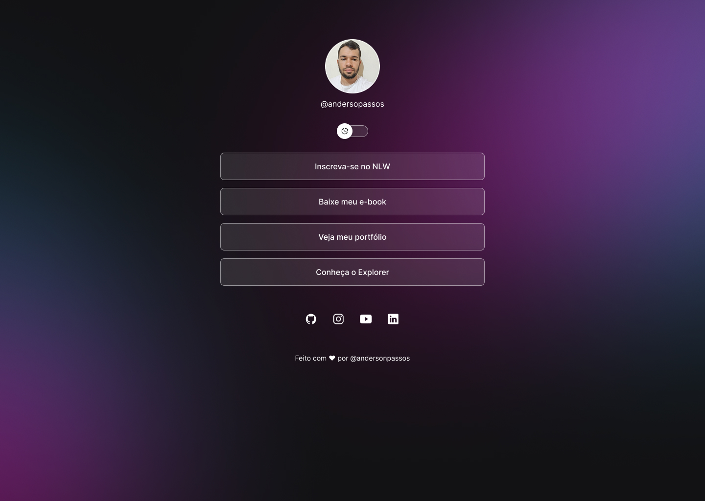

# DevLinks

Projeto desenvolvido por **@andersopassos** com HTML, CSS e JavaScript.  
Personalizado com minha identidade e inspirado no projeto da Rocketseat.

## 💻 O que é?

Uma página de links personalizados com modo claro/escuro. Ideal para compartilhar em redes sociais como Instagram, Twitter, LinkedIn e outras.

## 🚀 Tecnologias

- HTML5
- CSS3
- JavaScript
- Git e Github
- Figma

## 📸 Autor

**Anderson Passos**  
GitHub: [@andersondev123](https://github.com/andersondev123)

---

🛠️ *Projeto baseado no curso Discover da [Rocketseat](https://rocketseat.com.br)*  
✨ Personalizado por mim com 💻 e dedicação.
